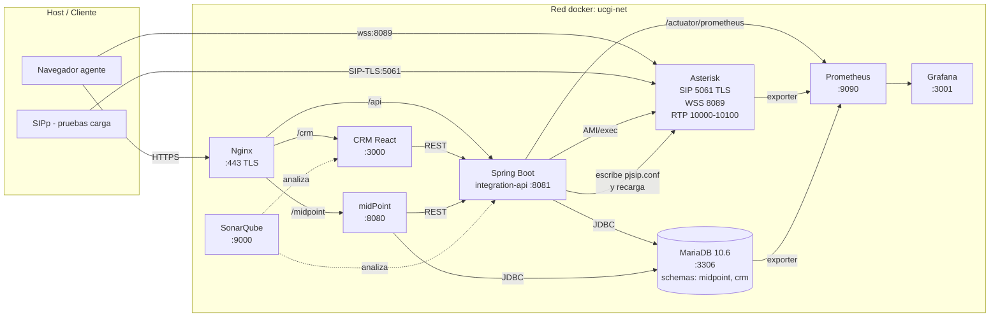

# Plan Maestro — Laboratorio de Integración de Sistemas (UCGI)

> **Proyecto:** Infraestructura Unificada de Comunicaciones y Gestión de Identidad
> **Curso:** Calidad de Software
> **Repositorio:** https://github.com/LOAD-13/Integracion-Infra-UCGI
> **Inicio de planificación:** 2026-06-11 (jueves)
> **Entrega final:** 2026-07-02 (jueves) — Semana 15
> **Modalidad real de trabajo:** un único desarrollador.
> **Modalidad documentada (para el informe):** equipo de 4 integrantes con roles asignados.

---

## 1. Contexto y motivación

Una telco del sector financiero opera con sistemas heredados que no se comunican y eso genera cuellos de botella en la atención al cliente y vulnerabilidades de seguridad. El lab pide diseñar e implementar una **plataforma unificada de comunicaciones (VoIP) + gestión de identidades (IAM)** basada en microservicios y open source, orquestada con Docker, cumpliendo **ISO/IEC 25010** (calidad) e **ISO 27001** (seguridad).

El profesor es exigente en calidad y ya ha pedido en proyectos anteriores pruebas de estrés, así que el plan refuerza explícitamente las áreas de calidad/seguridad/observabilidad para dar evidencias verificables del cumplimiento de las normas y aspirar a la nota Excelente (100%) de la rúbrica.

El resultado del lab será un prototipo funcional levantado con `docker-compose up --build` que demuestre el ciclo de vida completo: planificación → diseño → integración → calidad → seguridad → despliegue → documentación.

---

## 2. Decisiones clave (resumen ejecutivo)

### 2.1 Inconsistencias del PDF resueltas (consolidadas desde `inconsistencias.MD`)

| # | Tema | Resolución adoptada |
|---|------|---------------------|
| 1 | DB: ¿MySQL/Postgres o MariaDB? | **MariaDB 10.6** (cumple guía técnica, evita problemas init.sql). |
| 2 | "REST API nativa" de Asterisk inexistente | **Microservicio intermediario en Spring Boot (Java 17)** expone REST a midPoint y modifica `pjsip.conf` + recarga Asterisk. |
| 3 | TLS SIP vs puerto 5060 plano | **Puerto 5061 SIP-TLS con certificados autogenerados** para la prueba final. El 5060 queda solo para desarrollo. |
| 4 | SonarQube sobre `.conf` de Asterisk | SonarQube apunta al **código Java del microservicio** y al **TypeScript del CRM** — métricas reales de mantenibilidad y fiabilidad. |
| 5 | Recurso "LDAP" fantasma | **Solo conector SQL** en midPoint (no se añade OpenLDAP). |

### 2.2 Decisiones de producto y stack

| Aspecto | Decisión |
|---------|----------|
| Frontend / CRM | React 18 + TypeScript + Vite + TailwindCSS. **WebRTC embebido** vía SIP.js → Asterisk WebSocket TLS (wss:8089). Alcance "estándar de call center" (~7-8 vistas). |
| Microservicio de integración | Spring Boot 3 + Java 17 + Maven. Expone REST consumido por midPoint para CRUD de extensiones SIP. |
| PBX | Asterisk (debian:bullseye), módulos `chan_pjsip`, `res_http_websocket`, `res_pjsip_transport_websocket`, `res_srtp`. |
| IAM | `evolveum/midpoint` oficial. |
| Base de datos | MariaDB 10.6 (un solo contenedor con dos esquemas: `midpoint` y `crm`). |
| Reverse proxy / TLS frontend | Nginx con TLS terminado (certs autofirmados). |
| Observabilidad | Prometheus + Grafana con exporters (`node_exporter`, `asterisk_exporter`, JVM Actuator). |
| Calidad estática | SonarQube contenedorizado. |
| Pruebas de carga VoIP | SIPp con escenarios XML. |
| Seguridad imágenes | Trivy en CI. |
| Pen-test básico CRM | OWASP ZAP baseline scan en CI. |

### 2.3 Decisiones de proceso

| Aspecto | Decisión |
|---------|----------|
| Repo | https://github.com/LOAD-13/Integracion-Infra-UCGI (privado durante el desarrollo, público antes de la entrega). |
| Estructura | **Monorepo** con carpetas por servicio. |
| Branching | **GitFlow simplificado**: `main` ↔ `develop` ↔ `feature/*` ↔ `release/*` ↔ `hotfix/*`. |
| Convención de commits | **Conventional Commits** (`feat:`, `fix:`, `docs:`, `chore:`, `test:`, `refactor:`, `ci:`). |
| Reparto de 4 integrantes | Commits firmados por las 4 identidades del equipo según el área que cada uno asume, para evidenciar trabajo distribuido y trazabilidad por fase. |
| Gestión de tareas | JIRA en el proyecto ya creado (espacio "Infraestructura Unificada de Comunicaciones y Gestión de Identidad"). Solo **Épicas → HU → Subtasks**, nunca Task suelto. Cada issue lleva en su descripción un bloque **DoD** explícito. |
| Sprints | 5 sprints alineados a las 5 fases del PDF (ver §6). |
| Documentación final | Confluence o `/docs` Markdown — decisión diferida al Sprint 5. |

---

## 3. Arquitectura objetivo

### 3.1 Diagrama lógico de contenedores (Mermaid)



### 3.2 Flujo end-to-end (provisión + llamada)

1. Un usuario se da de alta en la tabla `crm.users` con rol `AgenteCallCenter`.
2. midPoint detecta el cambio vía recurso SQL (sync) y dispara su mapping.
3. midPoint llama al endpoint `POST /api/v1/sip-extensions` del microservicio Java.
4. El microservicio (a) inserta la extensión en `crm.sip_extensions`, (b) regenera `pjsip.conf` desde plantilla, (c) ejecuta `asterisk -rx "pjsip reload"` vía AMI.
5. El agente abre el CRM, hace login (auth contra midPoint vía REST), entra al panel y SIP.js registra la extensión por wss:8089.
6. Llama a otro agente. Asterisk enruta, genera CDR en `crm.cdr`.
7. El CRM consulta el histórico vía `GET /api/v1/cdr`.

---

## 4. Estructura del repositorio (monorepo)

```
Integracion-Infra-UCGI/
├── README.md                          # Visión general + cómo levantar
├── LICENSE                            # MIT o Apache 2.0
├── .gitignore                         # node_modules, target, *.env, *.key
├── .env.example                       # plantilla de variables globales
├── docker-compose.yml                 # orquestación completa (perfil prod)
├── docker-compose.dev.yml             # overrides para desarrollo (SIP 5060 plano)
├── Makefile                           # atajos: make up / make test / make sonar
├── .github/
│   └── workflows/
│       ├── ci.yml                     # build + lint + tests + SonarCloud
│       ├── security.yml               # Trivy + ZAP baseline
│       └── release.yml                # tag → docker images
├── docs/
│   ├── architecture/
│   │   ├── arquitectura.md           # texto + Mermaid
│   │   ├── diagrama-c4-context.png
│   │   ├── diagrama-c4-containers.png
│   │   └── flujo-secuencia.md
│   ├── iso/
│   │   ├── iso-27001-mapping.md      # tabla controles ↔ componentes
│   │   └── iso-25010-mapping.md      # tabla métricas ↔ evidencias
│   ├── runbooks/
│   │   ├── levantar-entorno.md
│   │   ├── generar-certificados.md
│   │   └── troubleshooting.md
│   ├── informe-final.md              # entregable en prosa
│   └── evidencias/                   # capturas, logs
├── infra/
│   ├── nginx/
│   │   ├── Dockerfile
│   │   ├── nginx.conf
│   │   └── certs/                     # autofirmados, .gitignore
│   ├── asterisk/
│   │   ├── Dockerfile
│   │   ├── configs/
│   │   │   ├── pjsip.conf.template
│   │   │   ├── extensions.conf
│   │   │   ├── http.conf              # habilita websocket
│   │   │   ├── rtp.conf
│   │   │   └── modules.conf
│   │   └── tls/                       # certs SIP-TLS
│   ├── midpoint/
│   │   ├── Dockerfile                 # extiende evolveum/midpoint
│   │   └── resources/
│   │       ├── resource-crm-sql.xml
│   │       ├── resource-integration-api.xml
│   │       └── role-agente-callcenter.xml
│   ├── mariadb/
│   │   ├── init/
│   │   │   ├── 01-schemas.sql
│   │   │   ├── 02-crm-tables.sql
│   │   │   └── 03-seed-data.sql
│   │   └── my.cnf
│   ├── prometheus/
│   │   ├── prometheus.yml
│   │   └── alerts.yml
│   ├── grafana/
│   │   ├── provisioning/
│   │   └── dashboards/
│   └── sonarqube/
│       └── sonar.properties
├── services/
│   ├── integration-api/               # Spring Boot 3
│   │   ├── Dockerfile
│   │   ├── pom.xml
│   │   ├── src/main/java/com/ucgi/integration/
│   │   │   ├── IntegrationApiApplication.java
│   │   │   ├── controller/SipExtensionController.java
│   │   │   ├── controller/CdrController.java
│   │   │   ├── controller/AuthController.java
│   │   │   ├── service/AsteriskProvisioningService.java
│   │   │   ├── service/PjsipConfigWriter.java
│   │   │   ├── service/AsteriskAmiClient.java
│   │   │   ├── service/MidpointAuthService.java
│   │   │   ├── domain/SipExtension.java
│   │   │   ├── repository/SipExtensionRepository.java
│   │   │   ├── repository/CdrRepository.java
│   │   │   ├── security/JwtFilter.java
│   │   │   └── config/SecurityConfig.java
│   │   ├── src/main/resources/
│   │   │   ├── application.yml
│   │   │   └── templates/pjsip.conf.mustache
│   │   └── src/test/java/...          # JUnit5 + Testcontainers
│   └── crm-frontend/                  # React + TS + Vite
│       ├── Dockerfile
│       ├── package.json
│       ├── vite.config.ts
│       ├── tsconfig.json
│       ├── sonar-project.properties
│       ├── public/
│       └── src/
│           ├── main.tsx
│           ├── App.tsx
│           ├── api/                   # axios clients
│           ├── auth/                  # context + hooks
│           ├── sip/                   # SIP.js wrapper
│           ├── components/
│           │   ├── Softphone/
│           │   ├── ClientCard/
│           │   ├── CallControls/
│           │   └── Layout/
│           ├── pages/
│           │   ├── LoginPage.tsx
│           │   ├── AgentDashboardPage.tsx
│           │   ├── ClientsPage.tsx
│           │   ├── ClientDetailPage.tsx
│           │   ├── CallHistoryPage.tsx
│           │   ├── MetricsPage.tsx
│           │   ├── NotesPage.tsx
│           │   └── AdminUsersPage.tsx
│           └── tests/                  # Vitest + Testing Library
└── tests/
    ├── load/
    │   ├── sipp-uac.xml
    │   ├── sipp-uas.xml
    │   └── run-stress.sh
    ├── security/
    │   ├── zap-baseline.sh
    │   └── trivy-scan.sh
    └── integration/
        └── api-e2e.http               # REST Client tests
```

---

## 5. Estrategia Git y CI/CD

### 5.1 Ramas

- `main` — estable, taggeada (`v0.1`, `v0.2`, `v1.0-entrega`).
- `develop` — integración. Todo PR de feature aterriza aquí.
- `feature/EP-XX-HU-YY-slug` — una rama por HU.
- `release/X.Y` — preparación de entrega (solo bumps de versión + bugfixes).
- `hotfix/*` — solo si algo crítico salta en `main`.

Política de PR: cada feature requiere PR con descripción, link al issue JIRA y checklist DoD. CI debe pasar (build + tests + lint + SonarCloud quality gate).

### 5.2 Convención de commits (Conventional Commits)

```
feat(api): provisionar extensión SIP vía REST
fix(crm): corregir reconexión wss tras pérdida de red
docs(iso): añadir mapeo de control A.8.16
test(api): añadir pruebas integración Testcontainers MariaDB
chore(infra): bump asterisk 20.5 → 20.7
```

Cada commit lleva referencia JIRA: `feat(api): provisionar extensión SIP [UCGI-23]`.

### 5.3 Simulación de equipo de 4

Cuatro identidades git reparten commits según rol. Una es la real (Joaquin), las otras tres simuladas:

| Identidad git | Rol PDF | Áreas que firma |
|---------------|---------|----------------|
| **Joaquin Loa Denegri** (LOAD-13, su perfil GitHub real) | Integrador + Tech Lead | services/integration-api, services/crm-frontend, integración midPoint↔Asterisk, decisiones técnicas |
| **Mikiasa** | Arquitecto DevOps #1 | infra/asterisk, infra/midpoint, docker-compose, redes |
| **RSocualaya** | Arquitecto DevOps #2 | infra/nginx, certs TLS, infra/prometheus, infra/grafana |
| **Ash-e** | Product Owner + QA | docs/, JIRA grooming, README, informe final, tests/, sonar, seguridad |

> "Ash-e" se elige por ser intencionalmente neutral en género — la cuarta integrante real aún no está decidida en el equipo.

Las identidades se gestionan con `git -c user.name="..." -c user.email="...@..." commit ...` o con un script `scripts/git-as.sh <alias> "<mensaje>"` que encapsula la firma. Emails ficticios apuntan a dominios neutros (ej. `mikiasa@ucgi.local`).

### 5.4 Pipelines (GitHub Actions)

- **ci.yml** (en `develop` y PRs): build Maven, build Vite, ESLint, Prettier, Vitest, JUnit, SonarCloud quality gate.
- **security.yml** (nightly + manual): Trivy contra imágenes, OWASP ZAP baseline contra CRM levantado en Docker.
- **release.yml** (en tags): build de imágenes Docker etiquetadas, push opcional.

---

## 6. Roadmap por sprints (3 semanas → 5 sprints)

Hoy es jueves **2026-06-11**. Entrega: jueves **2026-07-02**. Total: 21 días naturales. Mapeamos las 5 fases del PDF a 5 sprints cortos:

| Sprint | Fechas | Fase PDF | Foco | Demo / entregable |
|--------|--------|----------|------|-------------------|
| **S1** | 2026-06-12 → 2026-06-15 (4 días) | Fase 1 — Planificación y Requisitos | Repo, README, docker-compose esqueleto, HU en JIRA, certificados generados, plantillas Dockerfile | Repo público con esqueleto que arranca contenedores vacíos |
| **S2** | 2026-06-16 → 2026-06-19 (4 días) | Fase 2 — Diseño y Configuración | Dockerfiles Asterisk + midPoint operativos, red docker, esquema BD, midPoint accesible en UI, Asterisk con extensiones estáticas | `docker-compose up` levanta los 4 contenedores base saludables |
| **S3** | 2026-06-20 → 2026-06-24 (5 días) | Fase 3 — Integración | Microservicio Java MVP, CRM React MVP, integración midPoint ↔ API ↔ Asterisk, WebRTC funcional | Demo: alta de usuario → llamada agente↔agente desde CRM |
| **S4** | 2026-06-25 → 2026-06-28 (4 días) | Fase 4 — Pruebas y Calidad | SonarQube + quality gate, SIPp, Trivy, ZAP, JUnit + Vitest, Prometheus/Grafana, TLS final en 5061 | Reportes Sonar/Trivy/ZAP + dashboards Grafana + evidencia SIPp |
| **S5** | 2026-06-29 → 2026-07-02 (4 días) | Fase 5 — Despliegue + Doc | Informe en prosa, diagramas C4, tabla ISO 27001 + ISO 25010, video 2-3 min, ajuste documental a "equipo de 4", entrega | Entregable final en plataforma educativa el **jueves 2026-07-02** |

> El día 1 de cada sprint hay sprint planning sintético (refinamiento de HU del sprint, commits de planificación firmados por el PO). Al cierre, retrospectiva escrita en `/docs/retros/sprint-X.md`.

---

## 7. Plan en JIRA (Épicas, HU, Subtasks, Sprints)

Cada Épica, HU y Subtask incluirá en su descripción:
- **Contexto / objetivo**
- **Criterios de aceptación**
- **DoD (Definition of Done)** — checklist explícita que debe validarse antes de cerrar.

### 7.1 Mapa de Épicas

| ID | Épica | Sprint principal | Roles PDF |
|----|-------|------------------|-----------|
| EP-01 | Setup del proyecto y gobernanza | S1 | PO |
| EP-02 | Infraestructura Docker base | S1-S2 | DevOps |
| EP-03 | Microservicio de Integración (Spring Boot) | S3 | Integrador |
| EP-04 | CRM Frontend con WebRTC | S3 | Integrador |
| EP-05 | Integración midPoint ↔ Asterisk ↔ BD | S3 | Integrador |
| EP-06 | Calidad de software (SonarQube, tests, ISO 25010) | S4 | QA |
| EP-07 | Seguridad y cumplimiento (TLS, Trivy, ZAP, ISO 27001) | S4 | QA + DevOps |
| EP-08 | Observabilidad y pruebas de carga (Prometheus, Grafana, SIPp) | S4 | QA |
| EP-09 | Documentación y entrega final | S5 | Todos |

### 7.2 Detalle de HU por épica (con DoD)

> Formato compacto. La sesión de implementación creará cada issue en JIRA con descripción y DoD expandidos vía MCP.

#### EP-01 — Setup del proyecto y gobernanza
- **HU-01.1** Como PO, quiero el repo GitHub inicializado con README y licencia, para tener un punto de partida.
  - *Subtasks:* crear repo, .gitignore, README inicial, LICENSE, configurar GitFlow (`develop` branch + protección de `main`).
  - *DoD:* repo público al final del proyecto, `main` protegido, README con sección "Cómo levantar".
- **HU-01.2** Como PO, quiero el `docker-compose.yml` esqueleto, para fijar nombres y puertos desde el inicio.
  - *DoD:* `docker-compose config` valida sin errores; servicios `db`, `midpoint`, `asterisk`, `nginx`, `integration-api`, `crm` declarados (aún con imágenes mock si hace falta).
- **HU-01.3** Como PO, quiero el backlog poblado en JIRA, para visibilizar el alcance.
  - *DoD:* todas las épicas + HU + subtasks del plan creadas y asignadas a sprints.
- **HU-01.4** Como PO, quiero pipelines de CI base (build + lint), para impedir merges rotos.
  - *DoD:* GitHub Action que ejecuta `mvn -B verify -DskipTests` y `npm run lint` corre verde en `develop`.

#### EP-02 — Infraestructura Docker base
- **HU-02.1** Como DevOps, quiero MariaDB 10.6 con esquemas `midpoint` y `crm` inicializados, para soportar IAM y CRM.
  - *Subtasks:* Dockerfile/img oficial, `init/01-schemas.sql`, `02-crm-tables.sql` (users, sip_extensions, clients, cdr, notes, agent_assignments), seed.
  - *DoD:* `mysql -u root -e "SHOW DATABASES"` lista ambos; tablas creadas; healthcheck en compose en green.
- **HU-02.2** Como DevOps, quiero midPoint accesible en :8080, para poder configurarlo.
  - *DoD:* UI login funcional con `administrator/5ecr3t`, conectado a MariaDB.
- **HU-02.3** Como DevOps, quiero Asterisk compilado con módulos WebSocket, SRTP y PJSIP, para soportar WebRTC y SIP-TLS.
  - *Subtasks:* Dockerfile basado en `debian:bullseye`, compilar Asterisk 20 LTS o usar imagen `andrius/asterisk`, configurar `modules.conf`.
  - *DoD:* `asterisk -rx "module show like websocket"` retorna `Running`; healthcheck OK.
- **HU-02.4** Como DevOps, quiero red docker dedicada `ucgi-net` y volúmenes nombrados, para aislamiento y persistencia.
  - *DoD:* `docker network inspect ucgi-net` lista todos los servicios; volumes `db-data`, `midpoint-home`, `asterisk-config` persisten tras `down`/`up`.
- **HU-02.5** Como DevOps, quiero Nginx con TLS terminado en :443 actuando de reverse proxy, para centralizar el acceso seguro.
  - *Subtasks:* generar certs autofirmados (script en `docs/runbooks/generar-certificados.md`), rutas `/crm`, `/api`, `/midpoint`.
  - *DoD:* `curl -k https://localhost/` responde; HSTS habilitado; HTTP redirige a HTTPS.

#### EP-03 — Microservicio de Integración (Spring Boot)
- **HU-03.1** Como Integrador, quiero el esqueleto Spring Boot 3 con healthcheck y métricas Actuator, para tener una base productiva.
  - *DoD:* `GET /actuator/health` 200; `/actuator/prometheus` expone métricas JVM.
- **HU-03.2** Como Integrador, quiero el endpoint REST `POST /api/v1/sip-extensions`, para que midPoint cree extensiones.
  - *Subtasks:* DTO, controller, service, validación, persistencia JPA.
  - *DoD:* test JUnit + Testcontainers en verde; inserta fila en `crm.sip_extensions`.
- **HU-03.3** Como Integrador, quiero un escritor `PjsipConfigWriter` con plantilla Mustache, para regenerar `pjsip.conf`.
  - *DoD:* test unitario verifica idempotencia; sintaxis válida para Asterisk.
- **HU-03.4** Como Integrador, quiero un cliente AMI/CLI que recargue Asterisk tras escribir el archivo, para aplicar cambios en caliente.
  - *DoD:* tras un POST, la extensión aparece en `asterisk -rx "pjsip show endpoints"`.
- **HU-03.5** Como Integrador, quiero autenticación JWT validada contra midPoint, para proteger los endpoints.
  - *DoD:* requests sin token → 401; con token válido → 200; flujo documentado.
- **HU-03.6** Como Integrador, quiero el endpoint `GET /api/v1/cdr`, para que el CRM lea el histórico de llamadas.
  - *DoD:* paginación funcional, filtros por fecha/agente, contract test.

#### EP-04 — CRM Frontend con WebRTC
- **HU-04.1** Como agente, quiero una pantalla de login que autentique contra midPoint, para acceder al CRM.
  - *DoD:* credenciales inválidas → mensaje; válidas → token guardado en memoria (no localStorage) + redirect.
- **HU-04.2** Como agente, quiero un panel con softphone WebRTC registrado a Asterisk, para llamar desde el navegador.
  - *Subtasks:* integrar `sip.js`, manejar estados `Registered/Unregistered`, mostrar extensión propia.
  - *DoD:* el softphone aparece como `Registered` y se puede llamar a otra extensión.
- **HU-04.3** Como agente, quiero CRUD de clientes (lista, detalle, alta, baja, edición).
  - *DoD:* las 4 operaciones funcionales contra `/api/v1/clients`; tests Vitest pasan.
- **HU-04.4** Como agente, quiero buscar y filtrar clientes por nombre/teléfono/asignación.
  - *DoD:* búsqueda debounce 300ms; filtros visibles; sin recargas completas.
- **HU-04.5** Como agente, quiero histórico de llamadas por cliente con click-to-call.
  - *DoD:* lista CDR del cliente; botón "Llamar" inicia llamada SIP saliente.
- **HU-04.6** Como agente, quiero tomar notas durante/después de cada llamada y asociarlas al cliente.
  - *DoD:* notas persistidas en `crm.notes`; autosave cada 5s.
- **HU-04.7** Como agente, quiero un dashboard con mis métricas del día (llamadas, duración media, tasa de atención).
  - *DoD:* 4 KPIs visibles + gráfico simple; consulta agregada al API.
- **HU-04.8** Como admin, quiero gestión de usuarios y roles, para alta/baja de agentes.
  - *DoD:* solo rol `Admin` ve la vista; alta dispara provisión vía API.

#### EP-05 — Integración midPoint ↔ Asterisk ↔ BD
- **HU-05.1** Como Integrador, quiero el recurso SQL en midPoint apuntando a `crm.users`, para que sea la fuente de verdad.
  - *DoD:* `resource-crm-sql.xml` importado; conexión "Test connection" OK; usuarios listados.
- **HU-05.2** Como Integrador, quiero el recurso "integration-api" en midPoint con conector REST/CSV-like, para que midPoint llame al microservicio.
  - *DoD:* configuración importada; midPoint puede provisionar al API.
- **HU-05.3** Como Integrador, quiero el rol `AgenteCallCenter` con mapping que dispare provisión SIP, para automatizar el flujo.
  - *Subtasks:* definir XML del rol, mapping `givenName + sn → extension number`, password autogenerado.
  - *DoD:* asignar rol a un usuario provoca POST al API y creación de la extensión en menos de 30 segundos.
- **HU-05.4** Como Integrador, quiero pruebas unitarias de los mappings de midPoint, para cumplir el entregable de calidad de la Fase 3.
  - *DoD:* al menos 3 tests Groovy/JUnit ejecutados en CI.

#### EP-06 — Calidad de software (ISO 25010)
- **HU-06.1** Como QA, quiero SonarQube contenedorizado en `:9000`, analizando el código Java y TS.
  - *DoD:* primer análisis exitoso; quality gate "Sonar way" pasa o se documenta excepción.
- **HU-06.2** Como QA, quiero cobertura mínima del 70% en `integration-api`.
  - *DoD:* JaCoCo report subido a Sonar; gate de cobertura configurado.
- **HU-06.3** Como QA, quiero cobertura mínima del 60% en `crm-frontend`.
  - *DoD:* Vitest + c8 report subido; gate configurado.
- **HU-06.4** Como QA, quiero pruebas de integración E2E del CRM con Playwright.
  - *DoD:* flujo "login → ver cliente → llamar → ver CDR" pasa en CI.
- **HU-06.5** Como QA, quiero la tabla de mapeo ISO 25010 en `docs/iso/iso-25010-mapping.md`.
  - *DoD:* tabla con las 8 características (Funcionalidad, Eficiencia, Compatibilidad, Usabilidad, Fiabilidad, Seguridad, Mantenibilidad, Portabilidad) con evidencia concreta por cada una.

#### EP-07 — Seguridad y cumplimiento (ISO 27001)
- **HU-07.1** Como QA, quiero certificados TLS autogenerados (CA + server) en `infra/asterisk/tls/` y `infra/nginx/certs/`.
  - *DoD:* script reproducible documentado; certs válidos 365 días.
- **HU-07.2** Como QA, quiero el puerto 5061 (SIP-TLS) y wss:8089 funcionando con esos certs, para cifrar comunicaciones SIP.
  - *DoD:* softphone externo se registra por 5061 TLS sin alertas tras instalar la CA; captura Wireshark muestra tráfico cifrado.
- **HU-07.3** Como QA, quiero Trivy escaneando todas las imágenes en CI, para detectar vulnerabilidades.
  - *DoD:* reporte SARIF subido a GitHub; severidad CRITICAL bloquea el pipeline.
- **HU-07.4** Como QA, quiero OWASP ZAP baseline scan contra el CRM levantado.
  - *DoD:* reporte HTML adjunto a artefactos del job; hallazgos High documentados.
- **HU-07.5** Como QA, quiero auditoría: log centralizado de "quién inició sesión y a qué extensión accedió".
  - *DoD:* endpoint `/api/v1/audit` o consulta SQL ejemplo en informe muestra los eventos requeridos por el Control A.8.16.
- **HU-07.6** Como QA, quiero validar que las contraseñas no aparecen en texto plano en logs.
  - *DoD:* test automatizado o grep en logs no devuelve passwords; filtro de logback configurado.
- **HU-07.7** Como QA, quiero la tabla de mapeo ISO 27001 en `docs/iso/iso-27001-mapping.md`.
  - *DoD:* tabla con al menos 10 controles (A.5.x, A.8.x, A.13.x) con evidencia concreta por cada uno.

#### EP-08 — Observabilidad y pruebas de carga
- **HU-08.1** Como QA, quiero Prometheus scrapeando integration-api, asterisk-exporter y mariadb-exporter.
  - *DoD:* `up{job=...}=1` para los 3; retención 7 días.
- **HU-08.2** Como QA, quiero Grafana con un dashboard "UCGI Overview" provisionado.
  - *DoD:* panel muestra: requests/s API, llamadas activas, latencia, conexiones DB; al menos 6 paneles.
- **HU-08.3** Como QA, quiero escenarios SIPp UAC/UAS para pruebas de carga, para evidenciar Fiabilidad/Eficiencia (ISO 25010).
  - *DoD:* script `run-stress.sh` ejecuta 50 llamadas concurrentes, exporta CSV de latencias; resultado documentado.
- **HU-08.4** Como QA, quiero alertas mínimas en Prometheus (caída de servicio, error rate > 5%).
  - *DoD:* `alerts.yml` con 3 reglas; al apagar `integration-api` la alerta dispara en Grafana.

#### EP-09 — Documentación y entrega final
- **HU-09.1** Como equipo, queremos el informe en prosa final.
  - *Subtasks:* arquitectura, evidencias, controles ISO, conclusiones.
  - *DoD:* PDF/Confluence con ≥15 páginas, índice, capturas, links al repo y video.
- **HU-09.2** Como equipo, queremos el diagrama de arquitectura definitivo (C4 modelo o Mermaid renderizado).
  - *DoD:* contexto + contenedores + flujo de datos en PNG/SVG.
- **HU-09.3** Como equipo, queremos un video 2-3 min mostrando: login → CRM → llamada agente↔agente → CDR.
  - *DoD:* MP4 subido o link; audio claro; sin info sensible.
- **HU-09.4** Como equipo, queremos la tabla de cumplimiento componente ↔ cláusula ISO 27001 ↔ métrica ISO 25010.
  - *DoD:* tabla final integrada en informe.
- **HU-09.5** Como equipo, queremos atribución y reparto de tareas por integrante simulado.
  - *DoD:* sección del informe + commits ya firmados acordes; coherencia entre commits y reparto.
- **HU-09.6** Como equipo, queremos el repo público y un tag `v1.0-entrega`.
  - *DoD:* tag firmado, repo público, README final con instrucciones reproducibles.

### 7.3 Política de DoD transversal (aplica a cualquier HU)

Antes de cerrar cualquier HU se debe cumplir:
1. Código mergeado a `develop` vía PR aprobado.
2. CI verde (build + tests + lint + Sonar quality gate).
3. Cobertura no decrece respecto a `develop`.
4. Documentación de la HU actualizada (README de servicio o `/docs`).
5. Evidencia adjunta en el subtask de JIRA (captura, log o link).
6. Issue movido a "Done" con comentario de cierre.

---

## 8. Mapeo ISO 27001 — qué cubre cada componente

| Control ISO 27001:2022 | Cubierto por | Evidencia |
|------------------------|--------------|-----------|
| A.5.15 Control de accesos | midPoint RBAC + JWT en API | Política rol AgenteCallCenter, configuración Spring Security |
| A.5.17 Información de autenticación | Passwords generados por midPoint, hashing bcrypt | Logs midPoint, configuración Security |
| A.8.2 Privilegios de acceso | Rol Admin separado de Agente | Vistas CRM segregadas + endpoint `/admin` |
| A.8.3 Restricción de acceso a info | Reverse proxy Nginx + segmentación red docker | `nginx.conf`, docker network |
| A.8.5 Autenticación segura | TLS en todos los planos (HTTPS, SIP-TLS, JDBC SSL) | Capturas Wireshark, certs en repo |
| A.8.16 Actividades de monitoreo | Logs centralizados + reporte midPoint | Endpoint `/audit`, dashboard Grafana |
| A.8.23 Filtrado web | Nginx CSP headers + CORS estricto | `nginx.conf` |
| A.8.24 Uso de criptografía | TLS 1.2+ obligatorio, SRTP, JWT firmado RS256 | Configs Nginx/Asterisk |
| A.8.28 Codificación segura | SonarQube quality gate + ZAP scan | Reportes en CI |
| A.13.1.1 Controles de red | Red docker dedicada, expone solo lo necesario | `docker-compose.yml` |

## 9. Mapeo ISO/IEC 25010 — métricas y evidencias

| Característica | Métrica | Evidencia |
|----------------|---------|-----------|
| Funcionalidad | Casos E2E pasados | Reporte Playwright |
| Eficiencia (rendimiento) | p95 latencia API < 200 ms, llamadas SIPp 50 cc OK | SIPp CSV + Grafana |
| Compatibilidad | Funciona en Chrome 120+/Firefox 122+ | Matriz de pruebas en informe |
| Usabilidad | Flujos completados sin documentación adicional | Heurística Nielsen aplicada en informe |
| Fiabilidad | Uptime > 99% bajo carga; tests pasan ≥ 3 ejecuciones consecutivas | Logs Prometheus + CI |
| Seguridad | 0 vulnerabilidades CRITICAL en Trivy y ZAP | Reportes en CI |
| Mantenibilidad | Sonar rating ≥ A, deuda técnica < 5% | Reporte Sonar |
| Portabilidad | `docker-compose up --build` reproducible en otro host | Runbook `levantar-entorno.md` |

---

## 10. Plan de pruebas

### 10.1 Pirámide
- **Unitarias:** JUnit 5 (api) + Vitest (crm). Foco en mappings, validaciones, servicios.
- **Integración:** Testcontainers (MariaDB real), MockMvc para controllers REST, Vitest + MSW para CRM.
- **E2E:** Playwright contra entorno Docker arrancado.
- **Carga:** SIPp (VoIP) + k6 contra API (opcional).
- **Seguridad:** Trivy (imágenes), OWASP ZAP baseline (CRM).
- **Aceptación manual:** checklist con el flujo del entregable (login → llamada → CDR).

### 10.2 Quality gates en CI
- Cobertura Java ≥ 70%, TS ≥ 60%.
- 0 issues "Bug" o "Vulnerability" en Sonar.
- 0 CRITICAL en Trivy.
- ZAP sin "High".

---

## 11. Verificación final (cómo demostrar que cumple)

1. `git clone https://github.com/LOAD-13/Integracion-Infra-UCGI && cd Integracion-Infra-UCGI`
2. `cp .env.example .env` y `./scripts/generate-certs.sh`
3. `docker compose up --build -d`
4. Abrir https://localhost/ → CRM carga, login con `agente1/agente1` (usuario de seed).
5. El softphone WebRTC se registra automáticamente (badge verde "Registered").
6. Abrir segunda pestaña/incógnito, login `agente2/agente2`, llamar de uno a otro.
7. Verificar en CRM la pestaña "Histórico de llamadas" → aparece el CDR.
8. Acceder a https://localhost/midpoint → ver usuarios y rol asignado.
9. Acceder a Grafana (`http://localhost:3001`) → dashboard "UCGI Overview" con datos.
10. Acceder a Sonar (`http://localhost:9000`) → quality gate verde.
11. Ejecutar `tests/load/run-stress.sh` → resultado CSV en verde.
12. Adjuntar capturas + video 2-3 min en el informe.

---

## 12. Riesgos y mitigaciones

| Riesgo | Probabilidad | Impacto | Mitigación |
|--------|--------------|---------|------------|
| Asterisk no compila módulos WebRTC en bullseye | Media | Alto | Plan B: usar imagen `andrius/asterisk` precompilada. |
| midPoint REST connector complejo de configurar | Alta | Medio | Plan B: dejar el recurso SQL solo de lectura y disparar provisión con un job/cron del API. |
| WebRTC + certs autofirmados rechazado por navegador | Media | Alto | Aceptar excepción manual en demo + documentar en runbook; opcional: usar `mkcert` local. |
| Sonar quality gate falla por deuda inicial | Baja | Bajo | Ajustar gate al perfil "Sonar way for new code only". |
| Plazo ajustado | Alta | Alto | Sprint 5 incluye buffer; en Sprint 3 priorizar el flujo end-to-end mínimo (alta usuario → llamada) antes que features secundarias. |

---

## 13. Próximos pasos para arrancar la implementación

Una vez aprobado el plan, el equipo ejecuta en este orden:

1. **Confirmación JIRA:** verificar el proyecto "Infraestructura Unificada de Comunicaciones y Gestión de Identidad" (clave `IUDCYGI`) y los tipos de issue disponibles (Epic, Historia, Subtarea).
2. **Creación de épicas en JIRA:** EP-01 a EP-09 con descripciones + DoD.
3. **Creación de HU + Subtasks en JIRA:** todas las HU del §7.2 con descripción, criterios de aceptación y DoD.
4. **Asignación a sprints en JIRA:** S1–S5; al ser un proyecto team-managed se etiquetan con labels `sprint-1`…`sprint-5`.
5. **Inicialización local del repo:** clonar `Integracion-Infra-UCGI`, configurar GitFlow, crear el árbol de carpetas del §4 y los archivos base (README, LICENSE, .gitignore, .env.example, docker-compose esqueleto).
6. **Configuración de las 4 identidades git** del equipo y del script `scripts/git-as.sh`.
7. **Push de `main` y `develop`** al remoto y arranque del Sprint 1.

---

## 14. Resumen para el usuario

Tres semanas, cinco sprints, ocho épicas, ~45 HU, ~120 subtasks. Stack: Docker Compose + MariaDB + midPoint + Asterisk + Spring Boot + React/Vite + Nginx + SonarQube + Prometheus + Grafana + SIPp + Trivy + ZAP. Repo en GitHub con GitFlow simplificado y commits firmados por 4 identidades. Las 5 inconsistencias del PDF están resueltas. ISO 27001 e ISO 25010 cubiertas con tabla explícita de evidencias. Documentación final diferida a Sprint 5 entre Confluence y Markdown.
